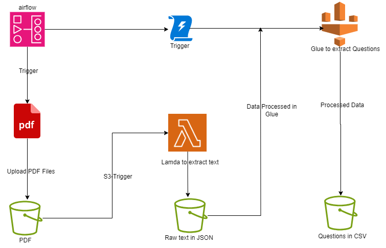

 
You can download the .drawio file from [here](./resources/aws-data-pipeline.drawio)

## Introduction
The objective of this pipeline is to extract past exam questions from Brazillian ENEM (National Exam of High School, on literal translation).
This exam occurs yearly and is the main entrance door to most public and private Brazilian universities. We will use this pipeline to do some data extraction and get questions from the exam.
 
The source document is PDF files. Our objective is to turn them to properly formatted CSV files and store them in S3 buckets as shown in the architecture above.

We will be installing Apache Airflow and Glue on localhost. Then we will use AWS Lambda and S3 service.

## Prerequisite
Clone the current repository.

## Tools to be used for the project

- _`S3`:_ to upload data and create different folders for different reasons
- _`Lambda`:_ for extraction of data from pdf to raw json format
- _`Glue`:_ for processing of data to get the questions from the data
- _`Airflow`:_ This is a workflow orchestrator. It’s a tool to develop, organize, order, schedule, and monitor tasks using a structure called DAG (Direct Acyclic Graph), The DAGS are all Python code.
- _`The data`_: The data is from the Brazillian ENEM 

## Steps:

1. Create the airflow environment by running: docker compose up (make sure you are in the path where the docker compose file is found. Access Airflow through: localhost:8080)

2. Create an S3 bucket called pipeline-enem-bucket (give a suitable name for your use case)

3. Create an IAM User called pipeline-enem and grant it admin permissions and save the access keys. (If you already have one setup, you can ignore this step.)

4. In the airflow UI (localhost:8080), under the admin-connections tab, create a new AWS connection, named AWSConnection, using the previously created access key pair.

5. Uploading files to AWS Using Airflow: Create a Python file inside the /dags folder, I named mine pipeline_process_enem_pdf.py

6. Create a ‘year’ variable in the Airflow UI (admin - variables). variable simulates the ‘year’ when the scraping script should execute, starting in 2010 and being automatically incremented (+1) by the end of the task execution.

7. Create a new Lambda function from scratch, name it process-enem-pdf, choose Python 3.9 runtime. lambda will automatically create an IAM Role. Make sure this role has the read and write permissions in the pipeline-enem-bucket S3 bucket. Increase the execution time to about 4 mins to the lambda.

8. Create a Python virtual env with venv: python3 -m venv pdfextractor

9. Activate the environment and install the dependencies : source pdfextractor/bin/activate pip3 install pypdf2 typing_extensions

10. Create a lambda layer and upload to lambda by running: (This has already been done, to ease your work. Just upload the archive.zip file as a layer to aws. bash prepare_lambda_package.sh

11. Add an S3 Trigger to the lambda function, make sure the suffix is .pdf and the events types: All object create events

12. Create a glue Crawler to create a catalog of the dataset. Name it: pipeline-enem-crawler and make sure to select the bucket up to the content folder. Make sure an IAM role is created and also create a database with the name: enem_pdf_project

13. Create a glue job named: Spark_EnemExtractQuestionsJSON and paste the code on process_pdf_glue_job.py and execute from airflow for the complete pipeline to be in action.

_NB: Make sure to delete all your processes afterwards to avoid the bills_

## License

MIT License

### Credits

- [Brazillian ENEM](https://enem.inep.gov.br)
